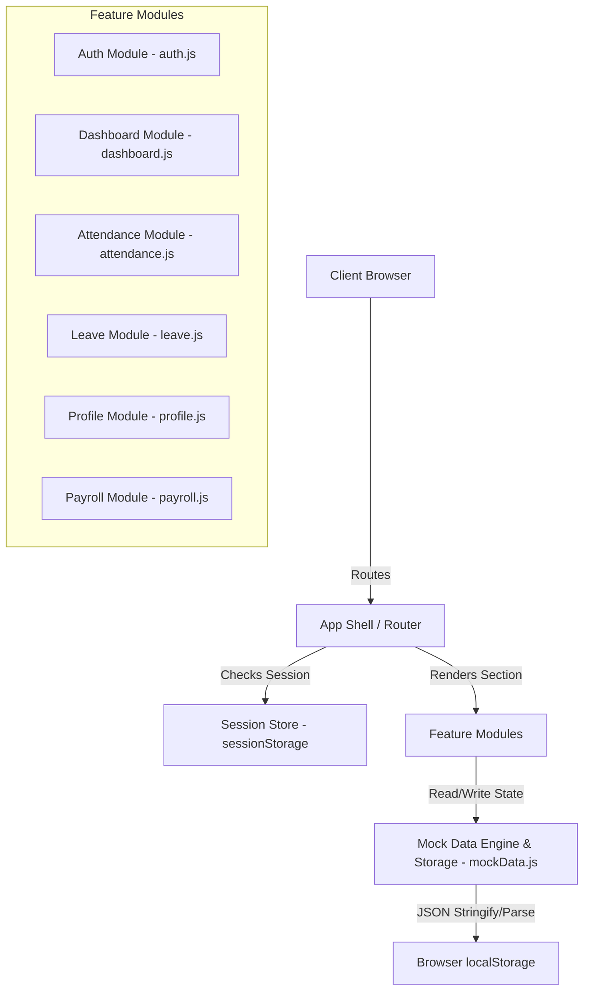
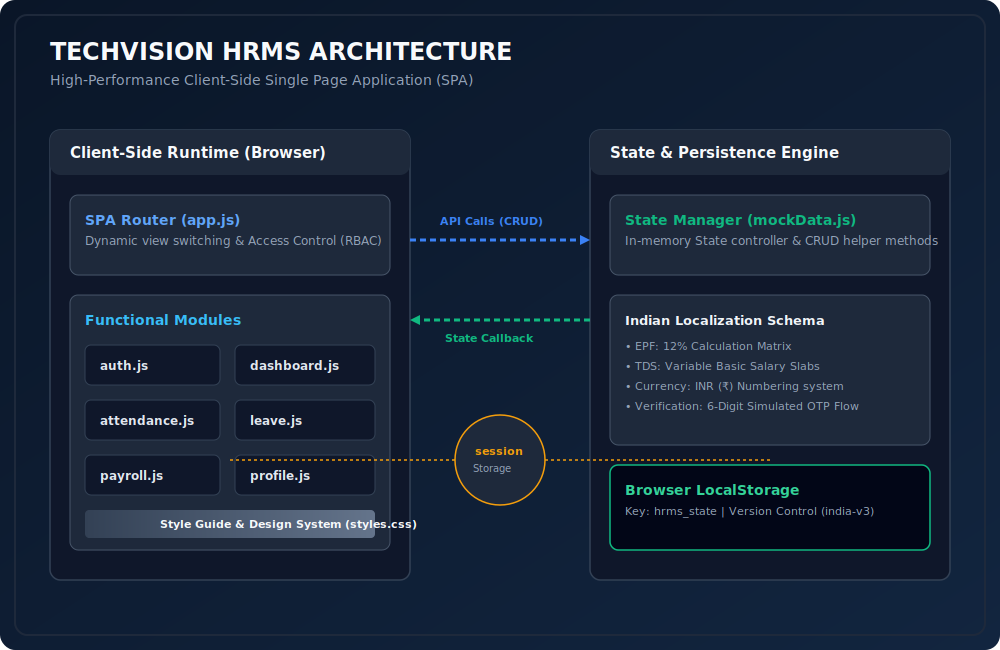

# TechVision HRMS 🇮🇳
### Enterprise Human Resource Management Single Page Application (SPA)

TechVision HRMS is a production-grade, client-side Single Page Application (SPA) designed to handle core human resource processes including Authentication, Leave Management, Attendance Tracking, Profile Customization, and Payroll processing. Localized specifically for the Indian enterprise ecosystem, the application uses advanced state persistence, client-side routing, and role-based access control (RBAC).

---

## 🏛️ System Architecture

The application is structured as a decoupled SPA utilizing standard web technologies (HTML5, Vanilla CSS, JS Modules) to maximize load speed and compliance. State is persisted in `localStorage` as a pseudo-database with versioning for automated migration and schema resets.



### Visual Architectural Flow Canvas



### Key Technical Specs
1. **Dynamic Client Routing**: Toggles active sections via CSS class manipulation (`.active`) without reloading the page, maintaining a persistent memory footprint.
2. **State Management**: Implements a unified state store (`State`) with CRUD helper methods wrapping localStorage.
3. **Data Versioning**: Automates migrations using a `DATA_VERSION` key to purge outdated state models whenever schema upgrades are deployed.
4. **💡 Production Storage Note (LocalStorage Limitations)**: 
   * For the demo and hackathon purposes, profile avatars and uploaded verified documents are encoded in Base64 format and stored directly within `localStorage`.
   * *Production Recommendation*: Since browser `localStorage` enforces a strict ~5MB quota limit, a production deployment should replace this model with an external object storage API (such as AWS S3, Google Cloud Storage, or Azure Blob Storage) and save only the resulting file URLs in the database.

---

## 💸 Indian Localization & Compliance

The payroll and database schema are fully localized for India.

*   **EPF (Employee Provident Fund)**: Calculated at standard rate of **12%** of basic salary.
*   **TDS (Tax Deducted at Source)**: Variable bracket tax deduction calculated dynamically against basic salary.
*   **Currency Representation**: All monetary units are formatted in **INR (₹)** adhering to the Indian Number System (`en-IN` formatting, i.e., `₹1,85,000` instead of `₹185,000`).
*   **Statutory Identification**: Includes PAN (Permanent Account Number) validation formats (`ABCDE1234F`).
*   **Organization Details**: Configured for *TechVision India Pvt. Ltd.* based in Mumbai, Maharashtra (GSTIN and corporate registration details built-in).

---

## 🔑 Demo Access Credentials

The database comes pre-seeded with 12 users spanning multiple departments. Test using these predefined credentials:

| Role | Email | Password | Employee ID | Department |
|---|---|---|---|---|
| **HR Admin** | `admin@techvision.in` | `Admin@123` | EMP-001 | Human Resources |
| **Employee** | `priya@techvision.in` | `Employee@123` | EMP-002 | Engineering |
| **Employee** | `rahul@techvision.in` | `Employee@123` | EMP-003 | Design |
| **Employee** | `sneha@techvision.in` | `Employee@123` | EMP-006 | Engineering |

---

## 📦 Features & Capabilities

### 🔒 1. Authentication & Security
- **Email/ID Verification**: Prevents duplicate registrations across emails or custom employee ID sequences.
- **Password Strength Analysis**: Active UI tracker showing length/character composition strength.
- **OTP Simulation**: Generates a 6-digit cryptographic registration code displayed dynamically on screen with automatic input box focus-advancing and clipboard paste capture.

### 📊 2. Role-Based Dashboards
- **Employee Portal**: Dynamic time-of-day greeting, custom KPI metrics (weekly hours, leave balance, attendance rate, net salary), and rapid check-in widget.
- **Admin Control Center**: Enterprise metrics tracking total headcount, daily present/absent stats, pending approvals queue, and monthly payroll budget summary.

### ⏱️ 3. Attendance Tracker & Logs
- **Interactive Calendar**: Visual grid mapping of monthly check-ins color-coded by status (Present, Absent, Half-Day, Approved Leave).
- **Check-In/Out Interface**: Time tracker with automated session-duration calculator.
- **History Logs**: Full table of previous attendances filterable by month.

### 🗓️ 4. Leave Management
- **Quota Tracking**: Visual bar graphs showing allocation consumption for Paid, Sick, and Unpaid leave.
- **Leave Request Workflow**: Working days calculation excluding weekends. Enforces quota limits dynamically.
- **Approvals Panel**: (Admin Only) Process pending leave requests with reviewer comment support.

### 👤 5. Employee Directory & Profiles
- **Corporate Directory**: Allows searching and filtering by department or name. Includes profile quick-views.
- **Data Customization**: Allows updates to personal contact numbers, PAN, bank details, gender, and blood group.

### 💰 6. Payroll & Payslips
- **Payslip Generator**: Clean breakdown of Earnings (Basic, HRA, Conveyance, Medical) and Deductions (TDS, EPF, Insurance) with standard print capabilities.
- **Payroll Manager**: (Admin Only) Modify components for any employee with real-time recalculation previews.

---

## 🛠️ Installation & Setup

1. **Clone the Repository**:
   ```bash
   git clone https://github.com/gintama1018/ODDO-X-ADAMS-HACKATHON-2026.git
   cd ODDO-X-ADAMS-HACKATHON-2026
   ```

2. **Serve Locally**:
   Run the dev server using node's `serve` package or any static file server:
   ```bash
   npx serve .
   ```
   Open `http://localhost:3000` (or the port specified by your server) in your browser.

---

## 💻 Tech Stack
- **Structure**: Semantic HTML5 markup
- **Styling**: Modern, responsive CSS3 using a custom Navy, Steel Blue, and Emerald color palette.
- **Behavior**: Pure ES6 Javascript Modules (No heavy framework dependencies, ensuring fast performance).
- **Data Storage**: Client-side `localStorage` pseudo-database.
